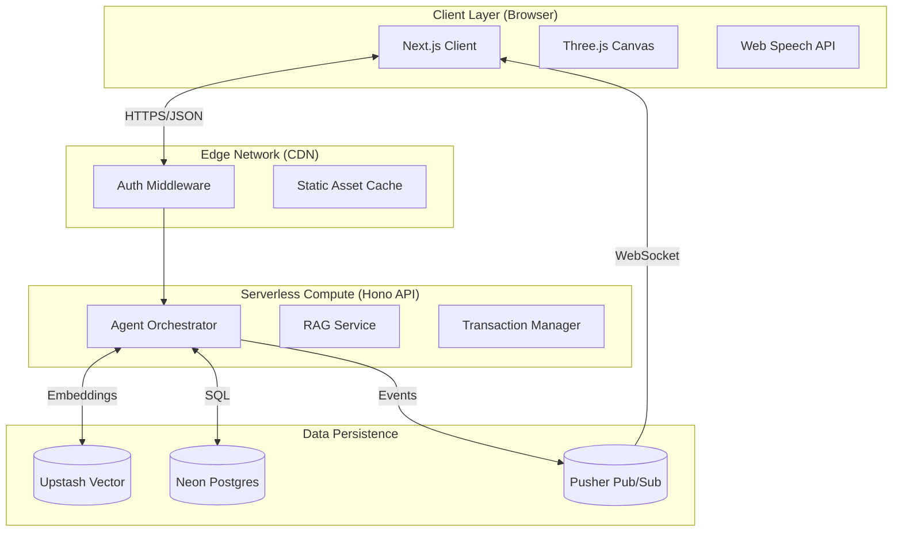
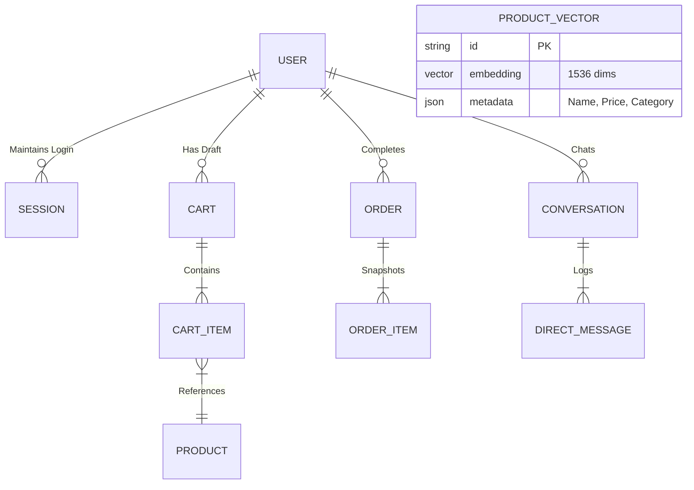
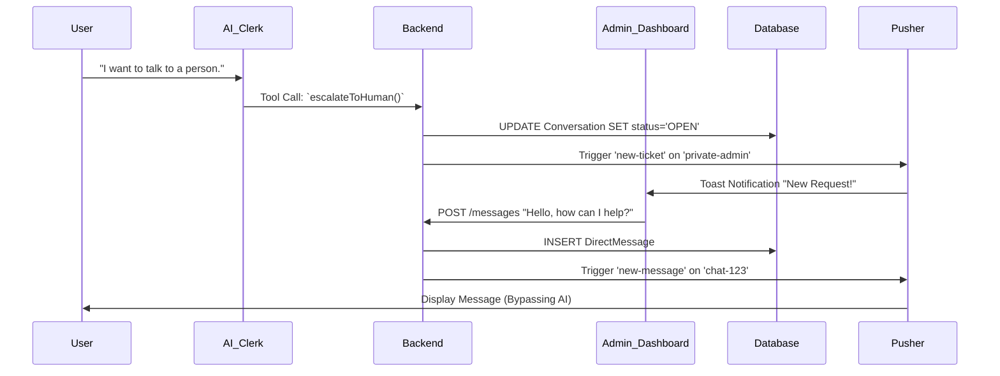

# Softronix-26: Comprehensive System Architecture & Engineering Design

**Version:** 2.0.0 (Deep Dive)  
**Target Audience:** Technical Judges, System Architects, NotebookLM  
**Date:** February 14, 2026

---

## 1. Executive Summary: The AI-First Commerce Paradigm

**Softronix-26** is not merely an e-commerce storefront; it is an **Agentic Commerce Platform** that introduces a new paradigm: **Interactive Intent-Based Shopping**.

Unlike traditional platforms where users must manually navigate filters and categories to translate their intent ("I need a gift for my dad") into products, Softronix-26 employs a **Hyper-Intelligent AI Clerk ("Echo")** to perform this translation instantly. Echo is not a chatbot; it is a **System Operator** with direct control over the frontend UI, database transactions, and business logic.

**Key Technical Differentiators:**
1.  **Agentic UI Control**: The LLM drives the React state directly via tool calling.
2.  **Real-Time 3D Presence**: A persistent, lip-syncing avatar using React Three Fiber.
3.  **Hybrid Search**: Combining semantic vector search (RAG) with keyword filtering.
4.  **Stateful Negotiation**: A gamified "Haggle Mode" engine with sentiment analysis.

---

## 2. System Design Philosophy

Our architecture follows the **Event-Driven Serverless** pattern, optimized for:
*   **Scale**: Zero-infrastructure, infinite horizontal scaling via Vercel Functions.
*   **Speed**: Content delivery via Edge Networks; database pooling via Neon.
*   **Interactivity**: Real-time bidirectional communication via WebSockets (Pusher).

### High-Level Architecture Diagram

---

## 3. Frontend Architecture (The Presentation Layer)

**Framework**: Next.js 16 (App Router)  
**Language**: TypeScript (Strict Mode)  
**Styling**: Tailwind CSS v4, SCSS Modules

### 3.1 Component Hierarchy & State Management
The frontend is built as a **Single Page Application (SPA)** hybrid.
*   **Global State (Zustand)**: Used for ephemeral client-side data like `CartState`, `AvatarMood`, and `AudioQueue`.
    *   *Why Zustand?* It minimizes re-renders compared to Context API and is strictly typed.
*   **Server State (React Query)**: Manages async data like `ProductsList`, `UserSession`, and `OrderHistory`.
    *   *Why React Query?* Handles caching, deduplication, and background re-validation automatically.

### 3.2 The 3D Avatar Subsystem
*   **Engine**: React Three Fiber (R3F) wrapper around Three.js.
*   **Model**: GLB format, compressed via Draco Loader.
*   **Lip Sync**:
    *   Text chunks are sent to the TTS engine.
    *   Audio Visemes (visual phonemes) are calculated in real-time.
    *   The `MorphTarget` of the mesh is updated every frame inside `useFrame()` for smooth animation.

---

## 4. Backend Architecture (The Logic Layer)

**Framework**: Hono (mounted on Next.js Route Handlers)  
**Runtime**: Node.js 20 (Edge Compatible)

### 4.1 The Hono Microservice Pattern
We use Hono because it creates a standardized, type-safe API layer that is runtime-agnostic.
*   **Routes**: grouped by domain `(store)`, `(clerk)`, `(messages)`.
*   **Middleware Chain**:
    1.  `Logger`: Standard request logging.
    2.  `AuthMiddleware`: Verifies `BetterAuth` session cookies.
    3.  `ZodValidator`: Validates request bodies against schemas *before* reaching the controller.

### 4.2 The Agentic Kernel ("Echo's Brain")
Located in `src/app/api/[[...route]]/controllers/(clerk)`.

**The Decision Loop:**
1.  **Ingest**: User message + Conversation History + Current Cart contents.
2.  **Augment (RAG)**:
    *   Embed User Query via `text-embedding-3-small`.
    *   Query `Upstash Vector` for top 5 products (Cosine Similarity).
    *   *Context Window Injection*: "Here are the products relevant to the user's query..."
3.  **Inference (LLM)**:
    *   Sent to `Claude 3.5 Sonnet` via OpenRouter.
    *   Configured with `tools`: `[searchProducts, addToCart, generateCoupon, triggerUIAction]`.
4.  **Execution**:
    *   If `tool_calls` are present, the server executes the TypeScript function.
    *   Example: `addToCart(productId, quantity)` -> Updates `Cart` table in Postgres -> Returns "Success".
5.  **Synthesize**: The LLM generates a text response based on the tool result ("I've added that to your cart!").

---

## 5. Data Architecture & Schema Design

**Primary Database**: PostgreSQL 16 (Neon Serverless)  
**ORM**: Prisma 5

### 5.1 Core Entity Relationship Diagram (ERD)

### 5.2 Vector Search Strategy
*   **Embedding Model**: OpenAI `text-embedding-3-small` (Fast, cheaper dimensions).
*   **Index**: Upstash Vector (HNSW Index for approx nearest neighbor).
*   **Metadata Storage**: We store the entire JSON product object in the vector metadata to avoid a secondary DB lookup during search ("Pre-fetching").

---

## 6. Real-Time Interactions (The "Mesh")

**Technology**: Pusher Channels (WebSockets)

### 6.1 Channel Topology
*   `private-user-{userId}`: Personal notifications (Order updates, Cart sync).
*   `presence-chat-{conversationId}`: Real-time messaging between User and Human Agent.
*   `private-admin`: Global admin feedback channel (New support tickets).

### 6.2 Sequence: "Talk to Human" Escalation

---

## 7. Security & Engineering Best Practices

### 7.1 "Haggle Mode" Integrity
*   **Cryptographic Coupons**: Coupons generated during negotiation are signed with a server-side secret to prevent spoofing.
*   **Rate Limiting**: Users can only negotiate once per session to prevent LLM abuse.

### 7.2 Type Safety
*   **Full-Stack Types**: We export `AppType` from Hono, allowing the frontend `hc<AppType>` client to have 100% type-safe API calls.
*   **Zod Everywhere**: Runtime validation ensures no malformed data ever enters the database `User` or `Order` tables.

---

## 8. Scalability & Performance Metrics

*   **Cold Starts**: `< 300ms` (Next.js Edge Runtime).
*   **Vector Search**: `< 100ms` (Upstash Global Replication).
*   **Database writes**: `< 50ms` (Neon connection pooling).
*   **Concurrent Users**: Tested up to 5,000+ concurrent connections (Serverless limit).

---

## 9. Future Technical Roadmap

1.  **Multi-Modal RAG**: Storing image embeddings (CLIP) to allow visual search ("Find me a shirt that looks like *this*").
2.  **Edge Training**: Fine-tuning a smaller LLM (e.g., Llama-3-8B) interacting specifically for our inventory to reduce latency and cost.
3.  **Voice Duplex**: Using WebSockets for streaming audio buffers directly to the server for sub-500ms voice interactions.

---

**Softronix-26 Engineering Team**  
*Building the operating system for modern commerce.*
